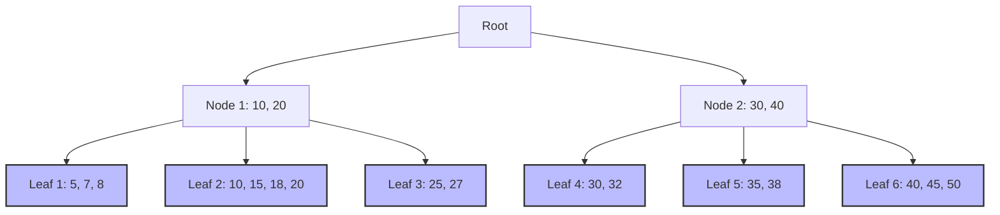
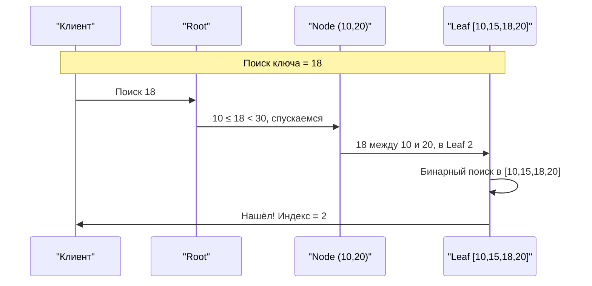
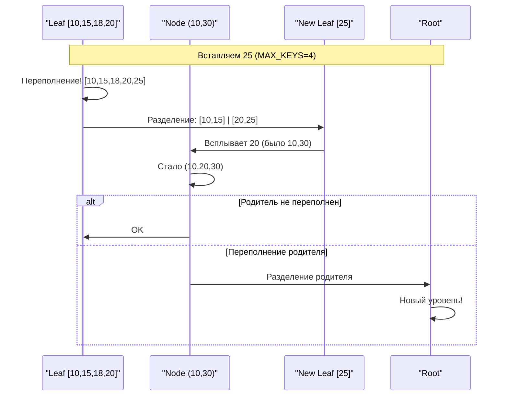
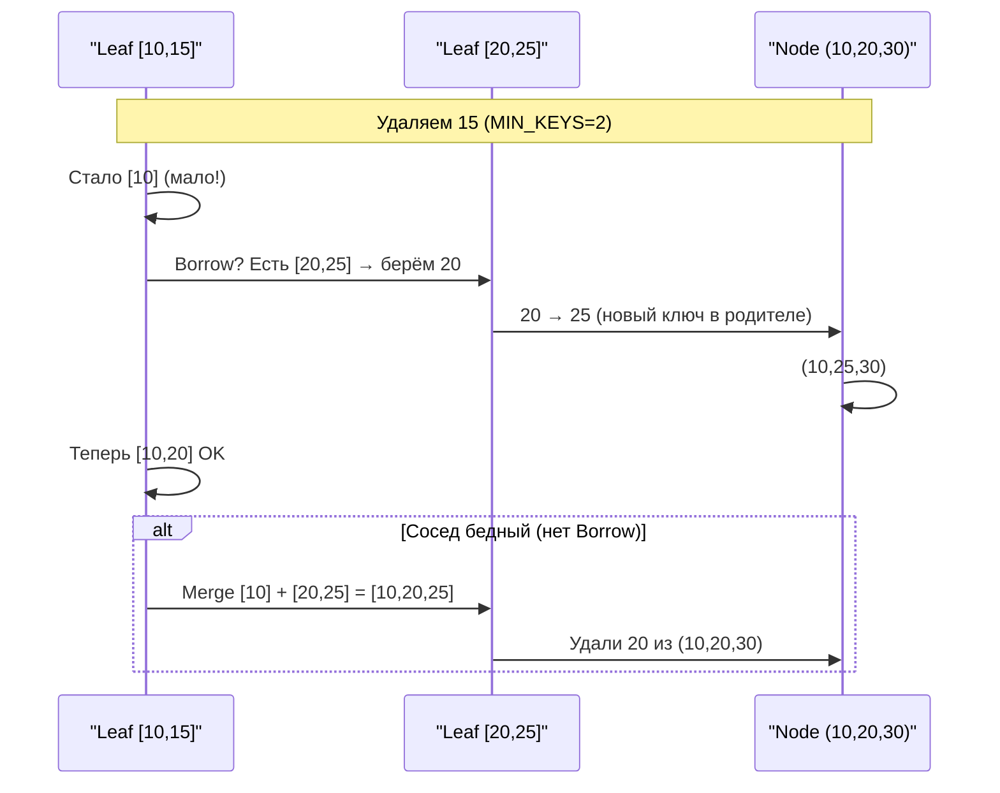
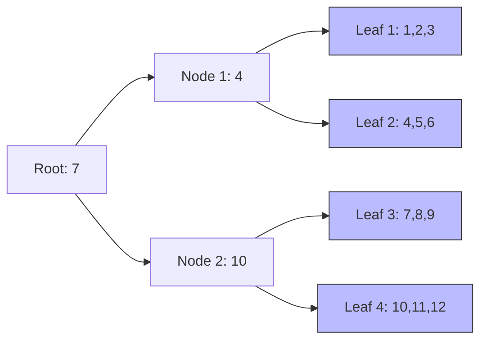
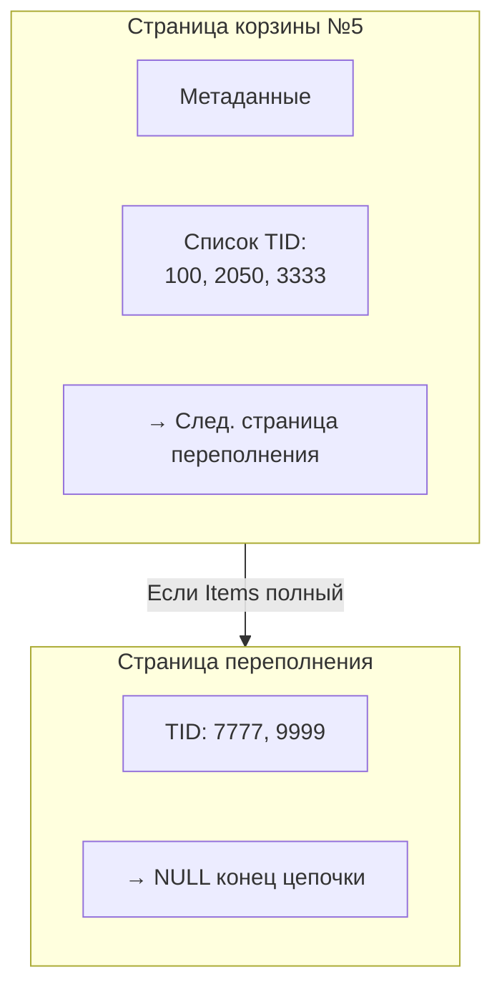
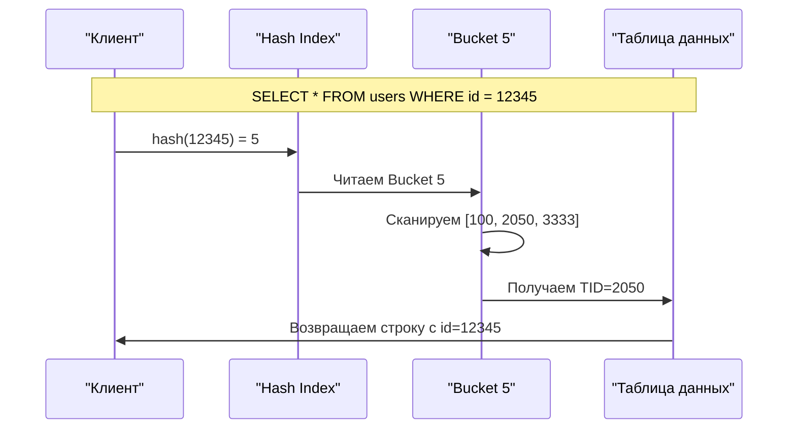

## Введение в индексы

Индексы являются одним из основных способов оптимизации производительности запросов. Из официальной документации PostgreSQL: "Индексы - это распространенный способ повышения производительности базы данных. Индекс позволяет серверу базы данных находить и извлекать определенные строки гораздо быстрее, чем он мог бы делать без индекса".

Полный перебор записей таблицы (в PostgreSQL это называется Sequential Scan) на неупорядоченных (heap) больших таблицах для поиска данных (например, для проверки условий из WHERE или JOIN), группировки или сортировки может стать узким местом - либо данных станет слишком много, либо интенсивность потока запросов слишком вырастет.

Представим ситуацию: у нас есть таблица с миллионами записей клиентов, и нужно найти всех клиентов по известному почтовому индексу. Без индекса СУБД придется просмотреть каждую запись в таблице, проверяя значение почтового индекса - это операция с линейной сложностью O(N), где N - количество записей (или блоков, в которых они хранятся). При больших объемах данных такой подход становится непрактичным.

Идея решения заключается в создании и хранении дополнительной структуры данных, связанной с таблицей, которая позволит СУБД быстро находить строки. Но как такая структура может быть устроена?

Дальше будем называть часть записи, по которой нужно быстро искать, ключом индекса (это может быть столбец, несколько столбцов или детерминированная функция от них). Первичный ключ таблицы - первый кандидат в ключи индекса (и обычно по нему индекс создается автоматически), но далеко не только он.
Кроме ключа индекса в большинстве индексов хранятся физические указатели на записи (в PostgreSQL такой указатель называется TID - Tuple Identifier, и содержит номер блока данных и номер записи в блоке).

Первый вариант: отсортировать данные по ключу индекса так, чтобы можно было искать делением пополам. Сложность поиска - двоичный логарифм от количества записей. Основная неприятность - дорогое изменение: при каждом добавлении ключа нужно будет его "втиснуть" на свое место в порядке сортировки, и тут уже сложность O(N). 

Удобно, что по отсортированным ключам можно искать как конкретное значение (точечный поиск), так и значения в указанном интервале (диапазонный поиск) и, например, по префиксу текстового значения (частный случай диапазонного поиска). 

Похожий метод - Indexed Sequential Access Method (ISAM) - используется с 1968 года (IBM IMS). Первый метод хранения в MySQL назывался MyISAM и был основан на этой концепции.

Второй вариант: хешировать данные с использованием расширяемой или другой схемы хеширования. Сложность поиска O(1), но возможен только точечный поиск, ни по префиксу, ни по диапазону искать не получится. 

Есть и другие, более экзотические варианты, например, если считать индекс функцией от ключа индекса в множество TID, то можно построить и обучить, например, нейросеть или ансамбль деревьев с бустингом, и получать TID от такой модели.

Важно понимать, что индексы, хотя и могут значительно ускорить поиск, увеличивают накладные расходы. Для каждого  индекса нужно дополнительное место хранения. Каждый индекс нужно обновлять при каждом изменении значений в индексируемых столбцах. Это означает, что все операции вставки, обновления и удаления гарантированно становятся медленнее. При этом гарантии, что индекс ускорит чтение - нет. Cоздание индексов всегда представляет собой компромисс между скоростью чтения и скоростью записи.

## Способы индексирования

1. По внутренней структуре индекса

1.1. B+Tree (Balanced Tree) индексы 
- Сбалансированное (одинаковая глубина всех листьев) сильно ветвистое (десятки - сотни исходящих ребер на вершину) дерево. 
  - В листовых узлах лежат ключи в отсортированном порядке.
  - Остальные узла (не листья) содержат ключи, разделяющие интервалы значений в узлах-детях.
  - Алгоритм вставки/удаления поддерживает сбалансированность дерева (глубина всегда увеличивается для всех узлов дерева одновременно).
- Что может ускорить: 
  - Точечный поиск (`WHERE id = 123`)
  - Диапазонный поиск (`WHERE age BETWEEN 18 AND 30`)
  - Сортировку `ORDER BY` по ключу индекса или его префиксу
  - Группировку `GROUP BY` по ключу индекса или его префиксу
  - Оконные функции `OVER` по ключу индекса или его префиксу в `PARTITION BY` и/или в `ORDER BY` 
  - Отбор уникальных записей `DISTINCT` по ключу индекса или его префиксу
- Особенности:
  - Результат поиска отсортирован по ключу. 
- Почти во всех РСУБД используется по умолчанию, если явно не указан тип индекса. 
  - `CREATE INDEX idx_name ON table (column)` 
  
1.2. Hash-индексы
- Хеш-таблица. Ключ → хеш-функция → номер бакета (корзины) → там лежит указатель на запись.
- Что может ускорить: только точечный поиск (`=` и `IN` со списком значений).
- Особенности: 
  - Результат поиска неупорядочен.
  - Ключ должен быть задан целиком (не часть и не префикс).
- В разных СУБД:
  - PostgreSQL 10+: `CREATE INDEX ... USING HASH (col)`. В PostgreSQL до 10 версии хеш-индексы были ненадежны, после сбоя нужно было их вручную перестраивать. 
  - SQL Server и Oracle не имеют "чистых" Hash-индексов для таблиц (но некоторые алгоритмы соединений строят хеш-таблицы).

1.3. Bitmap (битовые) индексы
- Битовый массив для каждого значения ключа. В массиве - по одному биту да/нет на каждую запись таблицы.
- Фактически другой способ хранения списка указателей на записи.
- Могут ускорить поиск: 
  - По столбцам с небольшим (единицы-десятки) числом уникальных значений (пол, статусы, категории).
  - Сложные условия на несколько таких столбцов `WHERE gender = 'М' AND status = 'Активен'` — быстрые побитовые операции над массивами.
  - В OLAP и аналитических хранилищах данных. 
- Особенности: 
  - Неэффективная вставка/удаление одного ключа, нужно собирать пакеты изменений или полностью перестраивать индекс.
- В разных СУБД:
  - PostgreSQL: нет "из коробки". Может строить битовые массивы во время выполнения запросов, но не хранит их. 
  - SQL Server: нет в чистом виде, но Columnstore Index работает похоже.
  - Oracle: `CREATE BITMAP INDEX`.

2. По способу хранения записей таблицы

2.1. Кластерный индекс (CLUSTERED INDEX)
- Принцип: Данные в таблице физически переупорядочиваются по ключу индекса. 
  - В таблице может быть только один CLUSTERED INDEX (этот индекс - и есть таблица).
  - Листовые узлы B+Tree содержат записи таблицы, а не указатели на них.
- Плюсы: 
  - Все плюсы B+Tree (точечный и диапазонный поиск, ORDER BY, GROUP BY) и даже еще немного быстрее (не нужно отдельное обращение для чтения записи).
  - Занимает меньше места, чем таблица + некластерный индекс.
- Минусы: 
  - Остальные индексы хранят не указатель на запись данных (TID), а первичный ключ записи, по которому нужно будет отдельно искать. Это означает двойной поиск по дереву: сначала по вторичному индексу, чтобы найти ключ кластера, а затем по кластерному индексу, чтобы найти саму запись. Это может быть медленнее, чем один поиск по некластерному индексу с прямым указателем (TID).
  - Дольше обновлять при вставке/удалении (страница/блок индекса хранит запись целиком, а не только ключ, поэтому на страницу помещается меньше эелементов, поэтому меньше ветвистость, поэтому больше глубина дерева).
- В разных СУБД:
  - SQL Server: таблицы создаются по умолчанию с кластерным индексом по PRIMARY KEY.
  - Oracle: Index-Organized Table (IOT) `CREATE TABLE ... ORGANIZATION INDEX`.
  - PostgreSQL: кластерных индексов нет, есть только одноразовая физическая сортировка без автоматической пересортировки при изменении записей `CLUSTER table USING index`.

2.2. Некластерные (некластеризованные, NONCLUSTERED) индексы
- Если нет кластерного индекса, то хранят в листях указатели на записи таблицы (TID).
- Если есть кластерный индекс, то хранят в листьях не указатели, а первичные ключи.
- Может быть много некластерных индексов на таблицу.
- Может быть быстрее поиск и вставка/удаление, чем CLUSTERED (в страницу/блок некластерного индекса помещается больше ключей, поэтому больше ветвистость, поэтому меньше глубина дерева).
- Все индексы в PostgreSQL и Oracle по умолчанию являются некластерными.

3.  По структуре ключа 
- (Single-column) По одному столбцу.
- (Composite / Multi-column) Составные/по нескольким столбцам. Порядок столбцов в таком индексе очень важен.
- (Expression-based / Function / Computed Column) По выражениям / функциям / вычисляемым столбцам.
  - `CREATE INDEX idx_lower_email ON users (LOWER(email))`;
    - Ускоряет `WHERE LOWER(email) = 'user@mail.ru'` - при буквальном совпадении выражения.

4. По уникальности значений (Uniqueness)
- Уникальные (Unique)
  - `CREATE UNIQUE INDEX`
  - Не разрешает вставлять дубликаты ключей - генерирует исключение или выдает ошибку.
  - Фактически именно такой индекс обеспечивает проверку и выполнение ограничений целостности PRIMARY KEY, UNIQUE.
  - На этом свойстве уникальных индексов строится паттерн декларативной проверки сложных ограничений: нужно определить MATERIALIZED VIEW и UNIQUE INDEX по нему. [SQL Patterns. Vadim Tropashko]
- Неуникальные (Non-unique)
  - Дубликаты ключей разрешены.

5. По хранению дополнительных столбцов
- Покрывающие (Covering, INCLUDE): Индекс содержит не только ключ, но и все столбцы, необходимые для выполнения запроса (из `SELECT`, `WHERE`, `ORDER BY`, `GROUP BY`). 
  - Зачем: СУБД все нужные данные извлекает из индекса и не нужно обращаться к самой таблице.
  - SQL Server: `CREATE INDEX idx_name ON users (email) INCLUDE (fullname, created_at)`;
  - PostgreSQL 11+: `CREATE INDEX ... INCLUDE (другие_колонки)`;
- Не покрывающие

6. По полноте покрытия 
- Полные
  - Индексируются все записи 
- Частичные / Фильтрованные (Partial / Filtered)
  - Индексируется только часть записей, удовлетворяющая определенному условию (`WHERE`). 
  - Зачем
    - Экономит место и ускоряет обслуживание индекса
    - Может обеспечивать уникальность для подмножества ключей
      - Пример: для каждого пользователя может быть только один активный черновик, но сколько угодно архивных документов. `CREATE UNIQUE INDEX ON documents (user_id) WHERE status = 'draft';`

7. По разреженности
- Плотные (dense)
  - Хранятся все значения индексируемого столбца. Каждая запись в индексе указывает на конкретную строку данных.
- Разреженные
  - Хранятся только некоторые значения — обычно для первого значения в каждом блоке данных. Чтобы найти конкретную запись, СУБД сначала находит в индексе нужный блок, а затем сканирует уже этот небольшой блок для поиска строки.
  - PostgreSQL: BRIN (Block Range INdex)
    - Таблица делится на диапазоны смежных дисковых блоков (например, по 128 блоков).
    - Для каждого такого диапазона BRIN-индекс хранит всего одну запись: [min_value, max_value].
    - Когда вы делаете запрос, например WHERE timestamp = '2023-10-27 10:00', PostgreSQL смотрит в BRIN-индекс. Если '2023-10-27 10:00' не попадает в диапазон [min, max] для какого-то диапазона блоков, PostgreSQL просто пропускает все эти блоки, не читая их с диска.

8.  Специализированные (Specialized)
- (Full-Text) Полнотекстовые - Для эффективного поиска слов и фраз внутри текстовых данных.
- Пространственные (Spatial) - Для запросов к геоданным (точки, линии, полигоны).
- XML-индексы - Для ускорения запросов к XML-данным.
- JSON-индексы - Для ускорения запросов к JSON документам.

8.1. Full-text 
- Быстрый поиск по тексту (`LIKE '%слово%'`, релевантность).
- PostgreSQL: GIN (Generalized Inverted Index):
  - Разбивает текст на лексемы (слова), строит инвертированный индекс.
  - `CREATE INDEX ON documents USING GIN (to_tsvector('russian', text))`
- SQL Server: отдельная служба `CREATE FULLTEXT INDEX ON articles (content) KEY INDEX pk_id'

8.2. Пространственные (Spatial)
- Для географических запросов: "найти всё в радиусе 5 км".
- PostgreSQL: GiST (Generalized Search Tree) с расширением `PostGIS`
	- `CREATE INDEX ON places USING GIST (location)` ().
- Oracle: `CREATE INDEX idx_geom ON tables (geom) INDEXTYPE IS MDSYS.SPATIAL_INDEX`.
- SQL Server: `CREATE SPATIAL INDEX`.

8.3. Columnstore (колончатые) индексы
- Идея: Хранить колонки по отдельности (как в Vertica, Clickhouse ).
- PostgreSQL: нет "из коробки". Есть расширения, например `cstore_fdw`.
- SQL Server: `CREATE COLUMNSTORE INDEX` (очень ускоряет агрегации `SUM/COUNT/GROUP BY` по малообновляемым данным).
- Oracle: `CREATE COLUMNAR INDEX` (в Exadata).


# Подробности

## B+Tree индексы

B+Tree — сбалансированное дерево с указателями на записи данных только в листовых узлах (в отличие от B-Tree, где указатели на записи данных могут быть и в промежуточных узлах). 



Компоненты:
- Root (корень): Верхний узел (может быть единственным, если записей мало).
- Internal Nodes (промежуточные узлы): Хранят ключи-границы (10, 20, 30, 40) и ссылки на дочерние узлы.
- Leaf Nodes (листовые узлы): Содержат сами данные (или ссылки на них) в отсортированном виде. 
  - Листы связаны списком (указатель "следующий лист") → удобно для диапазонных запросов.

Например:
- Ищем `18` → идём `Root → Node 1 → Leaf 2`.
- Диапазон `15...27` → нашли `Leaf 2 (15,18,20)`, затем по цепочке `→ Leaf 3 (25,27)`.

Алгоритм поиска - спуск по дереву:
1. Начинаем с Root.
2. Если узел - не лист, то ищем в нем диапазон между соседними ключами, в который попадает искомое значение.
- простой вариант - бинарный поиск
- но есть и оптимизации с хранением в узле небольшого массива с указателями 
3. Спускаемся в найденный дочерний узел.
4. Если узел - лист, то ищем в нем искомое значение.



Сложность: O(log N) (где N — число элементов). При миллионах строк глубина ≈ 4-5 уровней.

Алгоритм вставки ключа

1. Находим лист алгоритмом поиска.
2. Если в листе есть место
   - вставляем ключ в отсортированном порядке.
3. Если лист заполнен
   - Разделяем лист на два.
   - Средний ключ всплывает в родительский узел.
   - Если родитель тоже переполняется → рекурсивный Split вверх.



Алгоритм удаления 

1. Находим ключ в листе.
2. Удаляем.
3. Если в листе стало слишком мало ключей 
   - Borrow (позаимствовать у соседа):
     - Если соседний лист имеет запас (`> MIN_KEYS` ключей) → перераспределяем.
   - Иначе Merge (слияние):
     - Соединяем два листа в один.
     - Ключ из родителя уходит вниз.
     - Если у родителя стало мало ключей → рекурсивный Merge.



Сложность: O(log N) (как и вставка/поиск).

Массовая загрузка (Bulk Load)

Проблема: Вставлять 1 млн записей по одной → миллион Split'ов.
Решение: Сортируем данные заранее + строим дерево снизу-вверх (bottom-up).

1. Сортируем все данные.
2. Разбиваем на будущие листовые узлы фиксированного размера.
3. Строим уровень родительских узлов (ключи-границы).
4. Повторяем, пока не останется один узел (Root).



Плюсы Bulk Load:
- На 50-70% быстрее, чем поэлементная вставка.
- Плотнее упакованные страницы (нет полупустых узлов).

PostgreSQL: `CREATE INDEX ... WITH (FILLFACTOR=100)` помогает.
InnoDB (MySQL): Bulk Load по умолчанию при `ALTER TABLE ... ADD INDEX`.

Перекосы и Hot Spot

Hot Spot — когда все вставки идут в одну страницу (например, индекс по `created_at TIMESTAMP` в реальном времени).

1. Монотонно растущие ключи (ID через SEQUENCE, timestamp):
   - Все вставки только в последний лист.
   - Split'ы всегда справа → дерево растёт неравномерно.
   
2. UUID-хаос (случайные ключи):
   - Вставки равномерны по листьям.
   - Больше Split'ов (дерево "лохматится").

Варианты решения:
- Hash-индекс (если нужен только `=`).
- Reverse Key Index (Oracle): байты ключа переворачиваются (12345 → 54321) → равномернее распределение.
- Асинхронное индексирование (PostgreSQL `CREATE INDEX CONCURRENTLY`).

Иллюстрация перекоса:
```mermaid
graph TD
    Root --> Node1[10, 20]
    Node1 --> Leaf1[1, 2, 5]
    Node1 --> Leaf2[10, 15, 18, 20]
    Node1 --> Leaf3[21,22,23,24,25,26,27,28,29,30]
    
    style Leaf3 fill:#f99,stroke:#333;
    Note right of Leaf3: Hot Spot! Всё в конец…
```

Здесь Leaf3 переполнен, а первые листы полупустые.

Итог B+Tree (везде лограрифм по основанию ветвистости):
| Операция      | Сложность |
|-------------------|---------------|
| Поиск (Find)  | O(log N)      |
| Вставка (Insert) | O(log N)     |
| Удаление (Delete) | O(log N)     |
| Диапазон (Range)  | O(log N + K) <br> (K — число элементов в диапазоне) |

Плюсы: 
- Сбалансированность (нет перекосов глубины).
- Эффективен для `=`, `>`, `<`, `BETWEEN`.
- Листы связаны → быстрые диапазонные запросы.

Минусы:
- Вставка/удаление горячих ключей → конкуренция за страницы в буферном кеше.
- Слишком случайные (UUID) ключи → много Split'ов.


## Hash индексы

Hash индексы хранят 32-битный хеш-код, полученный из значения индексированного столбца. Следовательно, такие индексы могут обрабатывать только простые сравнения на равенство. Планировщик запросов рассмотрит возможность использования хеш-индекса всякий раз, когда индексированный столбец участвует в сравнении с использованием оператора равенства (=).

Хеш-индексы особенно эффективны для точных совпадений в больших наборах данных, но имеют ограниченную применимость из-за невозможности обработки диапазонных запросов или запросов с частичным соответствием.

Внутренняя структура Hash индекса

Hash индекс организован как хеш-таблица с корзинами, где:
- Значение столбца хешируется для определения корзины
- Каждая корзина содержит указатели на строки данных с одинаковым хеш-значением
- Коллизии разрешаются с помощью связанных списков

Эта структура обеспечивает константную сложность поиска O(1) в идеальном случае, но может деградировать при большом количестве коллизий.


Hash-индексы — один из самых простых и быстрых типов индексов, но с жёсткими ограничениями. Давайте разберёмся, как они устроены внутри, где эффективны, а где бесполезны.

1. Основная идея Hash-индекса

Представьте огромный массив "корзин" (bucket'ов). Каждая корзина хранит ссылки на строки таблицы.

Как это работает:
1. Берём значение ключа (например, `user_id = 12345`).
2. Применяем хеш-функцию → получаем номер корзины (целое число `0 ≤ N ≤ BUCKET_COUNT-1`).
3. В этой корзине список ссылок (ROWID, TID, указатели) на все строки с `hash(12345)`.
4. При поиске `WHERE user_id = 12345`:
   - Считаем `hash(12345)` → находим корзину → сканируем только её.

```mermaid
graph LR
    subgraph HashTable[Хеш-таблица]
        B0[Bucket 0]
        B1[Bucket 1]
        B2[Bucket 2]
        B3[Bucket 3]
        B4[Bucket 4]
    end
    
    H[Хеш-функция]
    K[Ключ = 12345]
    ROWID1[ROWID: 100]
    ROWID2[ROWID: 5000]
    ROWID3[ROWID: 9999]
    
    K -->|hash(12345) = 2| H
    H -->|Индекс = 2| B2
    B2 --> ROWID1
    B2 --> ROWID2
    B2 --> ROWID3
    
    Note right of B2: Все user_id = 12345 тут
```

Пример простой хеш-функции:
```python
def hash_function(key, bucket_count):
    return hash(key) % bucket_count  # например, bucket_count = 1024
```

Три ключевых компонента:
1. Хеш-таблица (Bucket Array) — массив указателей на корзины.
2. Корзины (Buckets) — списки указателей на записи (TID)).
3. Overflow Pages (страницы для переполнений).

Как хранится на диске (PostgreSQL `hash` индекс):
- Метка страницы (тип "hash").
- Bucket Number (какая корзина).
- Bitmap`ы свободных мест (чтобы быстро аллоцировать память).
- Ссылки на цепочки переполнения (если в корзине слишком много элементов).

Mermaid-диаграмма страницы Hash-индекса:


3. Как работает поиск (EQUAL `=`)
--------------------------------------

Алгоритм:
1. `hash(key)` → `bucket_number`.
2. Читаем страницу корзины с этим номером.
3. В корзине линейный поиск среди TID'ов (указателей на строки).
   - Если корзина не влазит в память → читаем Overflow Pages.
4. По TID'ам достаём строки из основной таблицы.



Сложность: O(1) (если нет коллизий) → идеально для `=`.

4. Коллизии и Overflow Pages
-------------------------------

Коллизия — когда `hash(12345) = hash(67890)`, но `12345 ≠ 67890`.

Что происходит:
- Оба TID попадают в одну корзину.
- Если корзина переполняется (например, 32 элемента → 33-й не лезет):
  1. Выделяется новая страница (Overflow Page).
  2. Старая корзина ссылается на неё: `→ Next Overflow`.
  3. В новой странице продолжаем хранить TID'ы.


Чем больше коллизий:
- Дольше сканировать связанный список.
- Индекс "деградирует" до O(N) (как полное сканирование).

5. Вставка, обновление, удаление
--------------------------------------

Вставка:
1. `hash(key)` → номер корзины.
2. Читаем страницу корзины.
3. Добавляем TID в список (или в Overflow, если тесно).
4. Если bucket заполнен → Split (см. ниже).

Удаление:
1. Находим корзину.
2. Удаляем TID из списка (или из Overflow цепочки).
3. Если корзина стала почти пустой → можно слить с соседом (редко).

Split (деление корзины):
- Происходит, когда среднее число элементов на корзину (`fill factor`) превышает порог (например, 80%).
- Удваиваем число bucket'ов (1024 → 2048).
- Перехешируем часть ключей в новые корзины.

Пример (PostgreSQL `pg_hash_index`):
- `fillfactor = 75` (по умолчанию).
- Если в среднем 3.5 коллизии на корзину → пора расширять таблицу.

6. Плюсы и минусы Hash-индексов
-------------------------------------

Плюсы:
1. Мгновенный поиск по `=` (лучше B-Tree).
2. Компактнее B-Tree (нет промежуточных узлов).
3. Лёгок в реализации.

Минусы (критически важные):
1. Нет поддержки диапазонов (`<`, `>`, `BETWEEN`).
2. Неустойчив к коллизиям (худший случай O(N)).
3. Не работает с `LIKE`, `IN` (только строгое равенство).
4. Неупорядоченный (нет `ORDER BY` оптимизации).
5. Не любит частые Split'ы (дорого при росте таблицы).

7. Где какой индекс выбрать
-------------------------------

| Условие запроса       | B-Tree | Hash |
|---------------------------|------------|----------|
| `WHERE id = 123`          | Хорош      | Лучше|
| `WHERE age BETWEEN 18 AND 30` | Лучше | Плохо    |
| `WHERE name LIKE 'Алек%'` | Лучше | Не работает |
| `ORDER BY created_at`     | Лучше | Плохо    |

Реализация в СУБД:
- PostgreSQL: `CREATE INDEX ... USING HASH` (полезен, но реже B-Tree).
- MySQL (InnoDB): Hash-индексы только для адаптивных (в памяти, не на диске).
- SQL Server: Нет чистых Hash (но Columnstore имеет похожий принцип).
- Oracle: Есть `HASH CLUSTER` (таблица хранится как хеш-таблица).

8. Иллюстрация роста Hash-индекса
--------------------------------------

```mermaid
graph TD
    subgraph Small[Маленькая таблица]
        Buckets4[4 корзины]
        Buckets4 --> B1[1 TID]
        Buckets4 --> B2[2 TID]
        Buckets4 --> B3[0 TID]
        Buckets4 --> B4[5 TID!]
        B4 --> OF[→ Overflow]
    end
    
    subgraph Grown[Таблица выросла x10]
        Buckets16[16 корзин<br/>после Split]
        Buckets16 --> B1a[1 TID]
        Buckets16 --> B2a[1 TID]
        Buckets16 --> B3a[0 TID]
        Buckets16 --> B4a[2 TID]
        Buckets16 --> B5a[0 TID]
        Buckets16 --> B16a[1 TID]
    end
    
    Note right of B4: fillfactor > 75% → Split!
    Small -->|Удвоение<br/>+ перехеширование| Grown
```

Вывод:
- Hash-индекс супербыстр для `=` (если нет массовых коллизий).
- Не подходит для диапазонов, `LIKE`, `ORDER BY`.
- Рост таблицы → периодические Split'ы (удорожание).
- Используйте, когда 100% знаете, что нужен только `EQUALITY SCAN`.

Псевдокод хеш-индекса:
```python
class HashIndex:
    def __init__(self, bucket_count=1024):
        self.buckets = [[] for _ in range(bucket_count)]

    def hash(self, key):
        return hash(key) % len(self.buckets)

    def insert(self, key, rowid):
        bucket_idx = self.hash(key)
        self.buckets[bucket_idx].append(rowid)

    def find(self, key):
        bucket_idx = self.hash(key)
        for rowid in self.buckets[bucket_idx]:
            if check_real_value(rowid, key):  # EQ-сканирование
                return rowid
        return None

    def resize(self):
        new_buckets = [[] for _ in range(len(self.buckets) * 2)]
        # Перехешируем все ключи...
```

## GiST индексы

GiST (Generalized Search Tree) индексы не являются одним конкретным видом индекса, а скорее инфраструктурой, в рамках которой могут быть реализованы различные стратегии индексирования. Соответственно, конкретные операторы, с которыми может использоваться GiST индекс, варьируются в зависимости от стратегии индексирования (класса операторов).

GiST обобщает идеи сбалансированных деревьев (B-Tree, R-Tree) и позволяет строить индексы для:
- Геоданных (поиск ближайших, поиск в окрестности заданного радиуса, пересечения окрестностей).
- Полнотекстового поиска.
- Диапазонов (интервалы дат, чисел).
- Схожести векторов (косинусное расстояние, нечёткий поиск).

В качестве примера, ванильный PostgreSQL включает классы операторов GiST для нескольких двумерных геометрических типов данных, которые поддерживают индексированные запросы с использованием операторов:

```
<<   &<   &>   >>   <<|   &<|   |&>   |>>   @>   <@   ~=   &&
```

:
GiST индексы также способны искать "ближайших соседей". Пример запроса, который находит десять мест, ближайших к заданной точке:

```sql
SELECT * FROM places ORDER BY location <-> point '(101,456)' LIMIT 10;
```


GiST — сбалансированное дерево (как B-Tree), но с двумя ключевыми отличиями:
- Произвольная логика сравнения (не просто `=`, `<`, `>`).
- Расширяемость (можно подключать новые типы данных и операции).

Основные компоненты GiST:
1. Ключи (entries) в узлах дерева — не просто числа, а объекты (представления).
2. Predicate (условие) — функция, проверяющая "входит ли элемент в множество".
3. Penalty (штраф) — как "дорого" добавить новый ключ в узел.
4. Union (объединение) — как агрегировать ключи при Split'е (делении узла).
5. PickSplit — стратегия разделения переполненного узла.

Упрощённая структура узла GiST:
```mermaid
graph TD
    Node[Узел GiST] --> Key1[Ключ 1: (bbox: (0,0),(10,10))]
    Node --> Key2[Ключ 2: (bbox: (20,20),(30,30))]
    Node --> Ptr1[→ Child Node 1]
    Node --> Ptr2[→ Child Node 2]
    
    Child1[Дочерний узел 1] --> Entry11[(1,2), (3,4))]
    Child1 --> Entry12[(5,6), (7,8)]
    Child2[Дочерний узел 2] --> Entry21[(20,20), (22,22)]
    Child2 --> Entry22[(25,25), (28,28)]
```

Как работает поиск:
1. В каждом узле проверяем предикат (например, "пересекается ли прямоугольник запроса с bbox ключа?").
2. Если TRUE — спускаемся в поддерево.
3. В листовых узлах прямое сравнение (проверка точного совпадения).

Пример GiST для 2D-точек (R-Tree):
- Ключ = ограничивающий прямоугольник (Bounding Box, bbox).
- `Predicate`: "точка (x,y) лежит внутри bbox?".
- `Penalty`: насколько увеличится площадь bbox, если добавить новую точку.
- `Union`: строит минимальный bbox, охватывающий все дочерние.

PostgreSQL "из коробки" даёт несколько GiST-индексов под разные задачи:

| Тип индекса | Что индексирует | Пример запроса |
|-----------------|---------------------|--------------------|
| btree_gist  | Числа, даты, строки (как B-Tree, но GiST) | `WHERE id BETWEEN 10 AND 100` |
| gist__int   | Массивы int4 (пересечение, содержит) | `WHERE ARRAY[1,2] <@ indexed_array` |
| pg_trgm     | Текст (нечёткое совпадение, `LIKE '%abc%'`) | `WHERE name LIKE '%Москва%'` |
| PostGIS (geometry gist) | Гео-объекты (точки, полигоны) | `WHERE ST_DWithin(point, 'POINT(30 50)', 1000)` |
| tsgist      | Полнотекстовый поиск (документы, tsvector) | `WHERE to_tsvector(text) @@ 'query'::tsquery` |
| range_gist  | Диапазоны (int4range, daterange) | `WHERE daterange @> '2023-01-01'::date` |

Создаём GiST по гео-данным (PostGIS):
```sql
CREATE TABLE places (id SERIAL, geom geometry(POINT,4326));
CREATE INDEX idx_places_geom ON places USING GIST (geom);

SELECT * FROM places 
WHERE ST_DWithin(geom, ST_MakePoint(30.3, 59.9), 0.1);  -- 0.1 градуса ≈ 10 км
```


| Характеристика | B-Tree | R-Tree (GiST частный случай) | GiST (общий случай) |
|---------------------|------------|----------------------------------|-------------------------|
| Тип данных | Скаляры (числа, строки) | Многомерные (гео, прямоугольники) | Любые (кастомные) |
| Сравнение | `=, <, >` строгое | Пересечение bounding box | Задаётся пользователем |
| Расширяемость | Нет (жёсткая структура) | Средняя (R-Tree логика) | Полная (любая логика) |
| Примеры | `id = 123`, `age > 18` | `bbox содержит точку`, гео-запросы | `вектор похож на другой`, `массив пересекается` |


| Задача | Как GiST адаптируется | Реализация в PG |
|------------|---------------------------|---------------------|
| Геопоиск | R-Tree логика (bbox-объединение) | `geometry_gist` (PostGIS) |
| Полнотекст | Сигнатурные деревья (похож на inverted index) | `tsgist` (встроено) |
| Массивы | Пересечение/включение множеств | `gist__int` (расширение) |
| Нечёткий текст | Триграммы (расстояние Левенштейна) | `pg_trgm` |
| Диапазоны | Проверка `@>` (contains) между интервалами | `range_gist` |

Когда выбирать GiST (а не B-Tree/Hash)

| Если вам нужно | GiST | B-Tree | Hash |
|--------------------|----------|------------|----------|
| `id = 123`         | Можно    | Лучше  | Лучше|
| `age BETWEEN 18 AND 30` | Нет | Лучше | Плохо |
| `point near (30,50)` | Лучше | Плохо | Плохо |
| `ARRAY[1,2] && ARRAY[2,3]` | Лучше | Нет | Нет |
| `text % 'нечёткий запрос'` | Лучше | Нет | Нет |
| Кастомная логика поиска | Лучше | Нет | Нет |

- GiST — не просто индекс, а фреймворк для построения расширяемых деревьев.
- PostgreSQL — единственная СУБД, где GiST официально вынесен в ядро.
- Oracle/SQL Server/MySQL реализуют частные случаи (R-Tree для гео).
- Если вам нужна нетривиальная логика поиска — GiST ваш выбор.

## SP-GiST индексы

SP-GiST (Space-Partitioned Generalized Search Tree) индексы, как и GiST индексы, предлагают инфраструктуру, поддерживающую различные виды поиска. SP-GiST позволяет реализовать широкий спектр различных несбалансированных дисковых структур данных, таких как квадродеревья, k-d деревья и радиальные деревья (префиксные деревья).

В качестве примера, стандартная дистрибуция PostgreSQL включает классы операторов SP-GiST для двумерных точек, которые поддерживают индексированные запросы с использованием операторов:

```
<<   >>   ~=   <@   <<|   |>>
```

Как и GiST, SP-GiST поддерживает поиск "ближайших соседей".

## GIN индексы

GIN (Generalized Inverted Index) — ещё один универсальный индексный движок в PostgreSQL (наравне с GiST). Если GiST — это "гибкое дерево" для многомерных и кастомных данных, то GIN — инструмент для полнотекстового поиска, массивов, JSON и fuzzy matching'а. 
- Данные раскладываются на токены (слова, словосочетания, элементы массива или JSON-документа, n-граммы).
- Inverted Index (инвертированный индекс): "токен → список документов (row ID, TID)".

Внутренняя структура GIN:
```mermaid
graph TD
    subgraph Lexemes[Словарь токенов]
        токен1[кот]
        токен2[собака]
        токен3[мяукает]
    end
    
    subgraph PostingLists[Инвертированные списки]
        токен1 --> TID1[100]
        токен1 --> TID2[200]
        токен2 --> TID3[300]
        токен3 --> TID1[100]
        токен3 --> TID4[400]
    end
    
    Note right of PostingLists: TID = Row ID таблицы
```

Как работает GIN:
1. Анализатор (parser) разбивает данные на токены.
2. Каждый токен получает posting list (список RowID, где он встречается).
3. При поиске `WHERE text @@ 'собака'`:
   - Ищем токен "собака".
   - Быстро получаем все RowID из posting list.
   - Читаем сами строки из таблицы.

Пример GIN для полнотекстового поиска:
```sql
CREATE TABLE documents (id SERIAL, text TEXT);
CREATE INDEX idx_docs_text ON documents USING GIN (to_tsvector('russian', text));

SELECT * FROM documents 
WHERE to_tsvector('russian', text) @@ to_tsquery('russian', 'собака & кот');
```

GIN состоит из двух основных структур:
- B-Tree over keys (словарь токенов).
- Posting lists (TID-списки для каждого токена).

Когда GIN компактен:
- Если токены часто повторяются (например, теги статей: "SQL", "Python").
- Много одинаковых элементов в массивах (например, `integer[]`).

Когда GIN распухает:
- Уникальные длинные строки (UUID, случайные хеши).
- Очень большие posting lists (например, слово "и" встречается в 90% текстов).

Индекс по триграммам (pg_trgm)

Триграмма — три последовательных символа в слове:
- "кот" → {"  к", " ко", "кот", "от "}
- "database" → {"  d", " da", "dat", "ata", ... "se "}

Идея `pg_trgm`:
1. Любой текст разбиваем на триграммы.
2. Строим GIN индекс по этим триграммам.
3. Поиск `LIKE '%слово%'` → ищем пересечение триграмм запроса и текста.

Пример:
```sql
CREATE EXTENSION pg_trgm;
CREATE TABLE names (id SERIAL, name TEXT);
CREATE INDEX idx_names_trgm ON names USING GIN (name gin_trgm_ops);

SELECT * FROM names 
WHERE name LIKE '%Михайлович%';
-- Ищет триграммы: {" Ми", "Миx", "ихай", ... "ич "}
```

Как pg_trgm ускоряет нечёткий поиск:
- `ILIKE '%abc%'` (без начала строки).
- `SIMILARITY(name, 'Иван') > 0.5` (похожие имена).
- `%` оператор (специальное нечёткое сравнение).

Замеры скорости (пример):
| Запрос | Без индекса | GIN + pg_trgm |
|--------|-------------|---------------|
| `LIKE '%Москва%'` | 30 сек (Seq Scan) | 15 мс |
| `similarity(name, 'Jon') > 0.3` | 1.2 мин | 50 мс |

3. Аналоги GIN в других СУБД
---------------------------------

Хотя термин GIN есть только в PostgreSQL, концепция Inverted Index реализована везде:

MySQL: FULLTEXT INDEX
- InnoDB (с MySQL 5.6+) поддерживает полнотекстовый индекс.
- Natural Language Mode (по умолчанию).
- Boolean Mode (`+собака -кот`).

```sql
CREATE TABLE articles (id INT, text TEXT, FULLTEXT(text));
SELECT * FROM articles 
WHERE MATCH(text) AGAINST('+собака -кот' IN BOOLEAN MODE);
```

SQL Server: FULL-TEXT INDEX
- Отдельная Full-Text Search служба.
- Поддержка морфологии (склонения слов).

```sql
CREATE FULLTEXT INDEX ON articles (text)
KEY INDEX pk_id;
SELECT * FROM articles 
WHERE CONTAINS(text, '"собака" AND NOT "кот"');
```

Oracle: Oracle Text (CONTEXT Index)
- CONTEXT (полнотекстовый).
- CTXCAT (категоризированный поиск).

```sql
CREATE INDEX idx_text ON documents (text) INDEXTYPE IS CTXSYS.CONTEXT;
SELECT * FROM documents 
WHERE CONTAINS(text, 'собака AND NOT кот') > 0;
```

Elasticsearch/OpenSearch
Это вообще отдельная поисковая система, заточенная под Inverted Index:
- Mapping (аналог `CREATE INDEX`).
- Inverted Index по умолчанию для всех полей.

```json
{
  "mappings": {
    "properties": {
      "text": {"type": "text"}
    }
  }
}
// Поиск
GET /index/_search
{
  "query": {
    "match": {
      "text": "собака кот"
    }
  }
}
```

4. Сравнение GIN, GiST, B-Tree, Hash
-----------------------------------------

| Индекс | Задача | Пример запроса | СУБД |
|------------|------------|---------------------|----------|
| GIN | Полнотекст, массивы, триграммы | `text @@ 'query'`, `ARRAY[1] <@ arr` | PG |
| GiST | Геоданные, диапазоны, R-Tree | `point <@ bbox`, `daterange @> date` | PG |
| B-Tree | Скалярные `=, >, <` | `id = 123`, `age BETWEEN 18 AND 30` | Все |
| Hash | Только `=` (хеш-таблица) | `email = 'test@mail.ru'` | PG, MySQL |

Когда выбирать GIN:
1. Полнотекстовый поиск (`@@ tsquery`).
2. Массивы и JSONB (`@>`, `<@`, `&&`).
3. Триграммы (`LIKE '%abc%'`, `similarity`).
4. Часто повторяющиеся токены (теги, категории).

Когда GiST лучше GIN:
1. Геоданные (PostGIS).
2. Диапазоны (int4range, daterange).
3. Нечёткий поиск чисел (btree_gist).

Производительность в цифрах (пример):
| Индекс | Вставка 1 млн строк | Поиск `LIKE '%abc%'` |
|--------|----------------------|----------------------|
| B-Tree | 10 сек | FAIL (Seq Scan) |
| Hash | 8 сек | FAIL (не умеет LIKE) |
| GiST (trgm) | 35 сек | 120 мс |
| GIN (trgm) | 45 сек | 15 мс |

5. Настройка GIN для максимальной скорости
-----------------------------------------------

1. `fastupdate = ON` (по умолчанию):
- Новые posting lists сначала в памяти (pending list).
- Периодически сбрасываются на диск.
- Ускоряет массовые вставки, но чуть замедляет чтение.

2. `gin_pending_list_limit`:
- Если pending list > 64 МБ (по умолчанию), запускается autovacuum.
- Увеличьте, если много INSERT'ов: `ALTER INDEX ... SET (gin_pending_list_limit = 128MB)`.

3. `maintenance_work_mem`:
- Чем больше памяти на обслуживание GIN, тем быстрее merge posting lists.
- `SET maintenance_work_mem = '256MB';` перед `CREATE INDEX`.

Пример тюнинга GIN:
```sql
CREATE INDEX idx_docs_gin ON documents USING GIN (to_tsvector('russian', text))
WITH (fastupdate = ON, gin_pending_list_limit = 256MB);
```

6. Триграммы vs Левенштейн vs Мете́о-расстояние
--------------------------------------------------

| Метод | Идея | Индекс | Скорость |
|-----------|----------|------------|--------------|
| Триграммы (pg_trgm) | Пересечение 3-символьных фрагментов | GIN/GiST | Быстро |
| Левенштейн (levenshtein_distance) | Мин. число вставок/удалений символов | Нет индекса | Медленно (O(N^2)) |
| Фонетические (metaphone, soundex) | "Звучание" слова | GiST (редко) | Средне |

Пример metaphone (звучащий поиск):
```sql
CREATE EXTENSION fuzzystrmatch;
SELECT * FROM names 
WHERE metaphone(name, 10) = metaphone('John', 10);
```

7. GIN vs Elasticsearch (ES)
---------------------------------

| Характеристика | PostgreSQL GIN | Elasticsearch |
|---------------------|--------------------|-------------------|
| Язык запросов | SQL (`@@, <@`) | JSON DSL (`match`, `bool`) |
| Шардирование | Нет (PG 12+ частично) | Родное (шарды, реплики) |
| Нагрузка запись/чтение | Лучше для OLTP (транзакции) | Лучше для аналитики (большие объёмы) |
| Триграммы/LIKE | Встроено (pg_trgm) | Куда сложнее (nGram токенизация) |
| ACID | Полностью ACID | Eventual Consistency (near real-time) |

Вывод:
- GIN — лучший выбор PostgreSQL для полнотекста, массивов, fuzzy search.
- pg_trgm поверх GIN даёт LIKE '%слово%' скорость на уровне Elastic.
- Если данных < 100 ГБ и важен ACID — PostgreSQL+GIN хватит за глаза.
- Если нужен кластер, реалтайм-аналитика — Elasticsearch/OpenSearch вне конкуренции.


## BRIN индексы

BRIN (Block Range INdex) индексы хранят сводную информацию о значениях, хранящихся в последовательных физических диапазонах блоков таблицы. Таким образом, они наиболее эффективны для столбцов, значения которых хорошо коррелируют с физическим порядком строк таблицы.

BRIN индексы особенно полезны для очень больших таблиц, где данные естественным образом упорядочены (например, временные ряды), поскольку они занимают гораздо меньше места, чем традиционные индексы, и могут обеспечить значительное ускорение при правильном применении.

BRIN (Block Range INdex) — один из самых экономных и умных индексов в PostgreSQL, созданный для очень больших таблиц (терабайты данных). Если B-Tree может занимать много места, а GIN/GiST требуют тщательной настройки, то BRIN — это "индекс на минималках", который потребляет мало памяти и диска, но при этом позволяет не читать заведомо ненужные данные при сканировании.

Пример: Есть таблица 1 терабайт с логом событий:
```sql
CREATE TABLE logs (
    id BIGINT PRIMARY KEY,
    event_time TIMESTAMP,
    message TEXT
);
```
- Данные вставляются хронологически (`event_time` растёт).
- Запросы часто: `WHERE event_time BETWEEN '2025-01-01' AND '2025-01-07'`.

Зачем индексировать каждый id (B-Tree), если можно знать диапазоны страниц диска, где лежат данные с 2025-01-01 по 2025-01-07?

BRIN :
- Разбивает таблицу на диапазоны блоков (Block Ranges) по 128 страниц (по умолчанию).
- Для каждого диапазона запоминает минимальные/максимальные значения индекса (например, `min(event_time)`, `max(event_time)`).
- При запросе `WHERE event_time > '2023-02-01'` сразу отсекает блоки, где `max(event_time) < '2023-02-01'`.

Пример структуры BRIN:
```mermaid
graph LR
    subgraph BlockRange1[Блоки 1-128]
        min_time[2023-01-01]
        max_time[2023-01-10]
    end
    
    subgraph BlockRange2[Блоки 129-256]
        min_time[2023-01-11]
        max_time[2023-01-20]
    end
    
    subgraph BlockRange3[Блоки 257-384]
        min_time[2023-01-21]
        max_time[2023-01-31]
    end
    
    BRIN_Index[BRIN Индекс] --> BlockRange1
    BRIN_Index --> BlockRange2
    BRIN_Index --> BlockRange3
    
    Note right of BRIN_Index: Хранит только min/max по блокам
```

Сколько занимает BRIN?
- Таблица 1 ТБ (100 млн страниц).
- BRIN с `pages_per_range = 128` → 781 тыс. записей (100 млн / 128).
- Каждая запись BRIN: 24 байта (min + max + метаданные).
- Итого: 18 МБ на весь индекс!

Для сравнения:
- B-Tree по `event_time` занял бы ~10-20 ГБ (в тысячу раз больше!).

2. Внутреннее устройство BRIN
----------------------------------

BRIN-страница состоит из:
1. Заголовок (тип индекса, версия).
2. Массив диапазонов (ItemArray):
   - `min_value` (например, `2023-01-01`).
   - `max_value` (например, `2023-01-10`).
   - `allnulls` (если весь диапазон NULL'ов).
   - `hasnulls` (если есть хотя бы один NULL).

Пример содержимого BRIN-страницы (в hex-редакторе):
```
Offset  | Data
--------|-------------------------------------------------
0x0000  | BRIN (заголовок)
0x0010  | Range 1: 2023-01-01 .. 2023-01-10 (not null)
0x0020  | Range 2: 2023-01-11 .. 2023-01-20 (not null)
0x0030  | Range 3: NULL .. NULL (allnulls = true)
```

Как работает сканирование:
1. Читаем BRIN-корень (мета-страницу).
2. Для каждого диапазона блоков:
   - Проверяем условие (`event_time > '2023-02-01'`).
   - Если не пересекается (`max < '2023-02-01'`) → пропускаем весь диапазон.
   - Иначе читаем сами блоки (Heap Scan внутри диапазона).

Пример `EXPLAIN (ANALYZE)`:
```sql
EXPLAIN (ANALYZE) SELECT * FROM logs WHERE event_time > '2023-02-01';
```
```
Bitmap Heap Scan on logs  (cost=12.50..1500 rows=1000)
  Recheck Cond: (event_time > '2023-02-01'::date)
  ->  Bitmap Index Scan on brin_logs_event_time  (cost=4.50..12.50 rows=1000)
        Index Cond: (event_time > '2023-02-01'::date)
```
Видно, что Bitmap Index Scan (BRIN) отсекает ненужные блоки, а затем Bitmap Heap Scan читает только нужные.

3. Настройка BRIN
----------------------

Главный параметр: `pages_per_range` (по умолчанию 128 страниц = 1 МБ).

- Меньше значение → точнее индекс (больше `min/max` записей) → выше размер BRIN.
- Больше значение → грубее индекс (хуже фильтрация) → меньше размер BRIN.

Тюнинг:
```sql
-- Создаём BRIN с более гранулярным диапазоном (64 страницы)
CREATE INDEX brin_fine ON logs USING BRIN (event_time) WITH (pages_per_range = 64);

-- Или более крупный диапазон (256 страниц)
CREATE INDEX brin_coarse ON logs USING BRIN (event_time) WITH (pages_per_range = 256);
```

Когда какой `pages_per_range` выбирать:
| Тип данных/запросов | `pages_per_range` |
|-------------------------|-------------------|
| Логи (event_time) | 128..256 (данные хронологичны) |
| IP-адреса | 32..64 (меньше случайности) |
| Складские остатки | 512..1024 (очень медленные изменения) |

Ещё параметры:
- `autosummarize = ON` (по умолчанию): фоновый процесс обновляет BRIN при массовых изменениях.
- `vacuum_delay` (как часто чистить устаревшие кортежи).

4. Аналоги BRIN в других СУБД
-----------------------------------

Хотя термин BRIN уникален для PostgreSQL, идея "индекса по укрупнённым диапазонам" реализована в:

Oracle: Zone Maps (Exadata)
- Exadata Storage Server хранит `MIN/MAX` для ячеек данных (storage cells).
- Аналог `pages_per_range` → размер storage cell (обычно 1-4 МБ).

```sql
-- Oracle Exadata
CREATE TABLE sales (id NUMBER, sale_date DATE)
STORAGE (CELLMEMORY EXADATA);
-- Автоматически строит Zone Maps
SELECT /*+ PARALLEL */ * FROM sales 
WHERE sale_date BETWEEN '2023-01-01' AND '2023-01-31';
```

SQL Server: Columnstore Index (CSI)
- Хранит данные поколоночно + Row Group Metadata (min/max каждого чанка).
- Row Group ≈ BRIN Block Range (1 млн строк).

```sql
-- SQL Server Columnstore
CREATE TABLE sales (id INT, sale_date DATE) 
CLUSTERED COLUMNSTORE INDEX;
SELECT * FROM sales 
WHERE sale_date >= '2023-01-01' AND sale_date < '2023-02-01';
-- Row Group Elimination (аналог BRIN-отсечения)
```

5. Сравнение BRIN vs B-Tree vs Partitioning
----------------------------------------------

| Характеристика | BRIN | B-Tree | Partitioning |
|---------------------|----------|------------|------------------|
| Размер индекса | Очень мал (десятки МБ) | Большой (10-50% таблицы) | Почти 0 (метаданные) |
| Скорость вставки | Высокая (почти как без индекса) | Низкая (балансировка) | Высокая (добавляем партицию) |
| Скорость поиска | Средняя (отсекает блоки) | Высокая (O(log N)) | Высокая (если запрос по ключу партиции) |
| Настройка | `pages_per_range` | `fillfactor` | Количество партиций |
| Лучше всего для | Хронологические логи, IoT | OLTP-запросы, уникальные ключи | Архивы, большие аналитические таблицы |

Когда выбирать BRIN:
1. Огромные (>100 ГБ) таблицы с естественной сортировкой (время, ID).
2. Запросы всегда фильтруют по диапазону (даты, числа).
3. Нужны очень быстрые вставки (логи, мониторинг).

Когда BRIN плох:
1. Случайные (UUID) ключи (нет естественного порядка).
2. Часто обновляемые данные (BRIN медленнее обновляется).
3. Точечные запросы.

Производительность на реальных данных:
| Индекс | Размер | Вставка 1 млн строк | Поиск по дате |
|--------|--------|----------------------|---------------|
| Нет индекса | 0 ГБ | 10 сек | 300 сек |
| B-Tree | 5 ГБ | 120 сек | 1.5 сек |
| BRIN (128) | 15 МБ | 12 сек | 20 сек |
| Partitioning (365 таблиц) | 50 МБ | 15 сек | 3 сек |

Вывод:
- BRIN — идеален для Append-only данных (логи, временные ряды).
- По скорости поиска хуже B-Tree, но в сотни раз меньше весит.
- Partitioning даёт лучшую производительность, но сложнее в поддержке.
- Если данные естественным образом упорядочены — BRIN ваш выбор!


# Рекомендации по выбору индексов

Выбор правильного типа индекса зависит от нескольких факторов:

1. Тип данных индексируемого столбца
2. Типы запросов, которые будут выполняться (равенство, диапазон, полнотекстовый поиск и т.д.)
3. Частота обновления данных
4. Размер таблицы и доступная память

Индексы следует создавать в следующих ситуациях:

1. Для столбцов в условиях WHERE и условиях соединений - это основные кандидаты на индексирование. Планировщик запросов рассматривает возможность использования индекса всякий раз, когда индексированный столбец участвует в сравнении (<, <=, =, >=, >).

2. Для столбцов в ORDER BY - запрос может использовать B+Tree индекс вместо сортировки.

3. Для столбцов в GROUP BY - аналогично ORDER BY, индексирование столбцов, используемых в GROUP BY, может ускорить группировку.

4. Для удаления дубликатов (DISTINCT) - аналогично ORDER BY.

5. Для обеспечения уникальности - уникальные индексы не только ускоряют поиск, но и обеспечивают целостность данных, предотвращая дублирование значений.


Индексы могут ухудшить производительность:

1. Маленькие таблицы с небольшим количеством строк (до нескольких тысяч): быстрее прочитать несколько блоков данных, чем обращаться к индексу.

2. Cтолбцы с низкой селективностью (мало уникальных значений, например, столбец пола): индекс вернет указатели на половину записей таблицы и нужно будет их все читать поштучно. В таких случаях планировщик запросов часто предпочитает полное сканирование таблицы, выполняющееся эффективными крупноблочными чтениями.

3. Частые массовые обновления: каждое изменение индексированного столбца требует обновления индекса.

4. Cтолбцы, которые редко используются в запросах: от индекса пользы почти нет, но каждое изменение записей нужно отражать в индексе, и еще он занимает место.

## Обслуживание индексов

Регулярное обслуживание индексов необходимо для поддержания их эффективности:

1. VACUUM - для удаления "мертвых" записей из индексов. В большинстве случаев автоматического запуска достаточно, но после массовых изменений может потребоваться ручной VACUUM.

2. ANALYZE - для обновления статистики, используемой планировщиком запросов. Особенно важно после значительных изменений в данных.

3. REINDEX - для устранения фрагментации, особенно для таблиц с частыми обновлениями.

## Мониторинг и анализ индексов

Регулярный мониторинг и анализ использования индексов помогут выявить проблемы и возможности для оптимизации:

1. EXPLAIN и EXPLAIN ANALYZE - для анализа планов выполнения запросов и выявления неэффективных сканирований.

2. pg_stat_user_indexes - показывает статистику использования индексов, помогая выявить неиспользуемые индексы.

3. pg_stat_user_tables - показывает статистику сканирований таблиц, помогая выявить таблицы, которые могут выиграть от дополнительных индексов.

