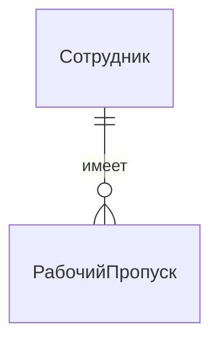

# **Базы данных 2025**

# **Лекция 2: Концептуальное моделирование данных**

## От бизнес-хаоса к инженерному порядку с помощью ER-диаграмм
---

## План на сегодня

1.  **Зачем нужен чертеж?** Три уровня абстракции при проектировании БД.
2.  **Наши инструменты:** Базовые "кирпичики" ER-модели (сущность, атрибут, связь).
3.  **Грамматика данных:** Кардинальность и модальность — как правильно читать связи.
4.  **Продвинутые концепции:**
    *   Рекурсивные связи (связи "на себя").
    *   Слабые сущности и идентифицирующие связи.
    *   Тернарные связи (когда двух мало).
    *   Генерализация и специализация (Наследование в данных).
5.  **Пример:** Проектируем ER-диаграмму для системы бронирования коворкинга.
6.  **Что дальше?** От концептуальной модели к логической.

---

## 1. Зачем нужен чертеж?

Представьте, что вы строите небоскреб. Вы же не начнете сразу заливать бетон? Вам нужен план. В мире данных все так же.

**Три уровня проектирования:**

1.  **Концептуальная модель (Наш фокус сегодня):**
    *   **Что это?** Архитектурный эскиз. Верхнеуровневый чертеж, понятный и инженерам, и бизнесу.
    *   **На чем основан?** На требованиях бизнеса ("хотелках").
    *   **Инструмент:** **ER-диаграммы (Entity-Relationship Diagram).**

2.  **Логическая модель (Следующая лекция):**
    *   **Что это?** Детальный план этажей. Описание данных в виде таблиц, колонок, ключей, но без привязки к конкретной СУБД.

3.  **Физическая модель:**
    *   **Что это?** Строительная документация. Конкретная реализация для PostgreSQL, включая типы данных, индексы, партиционирование.

> Мы идем от общего к частному, от абстрактного к конкретному. Ошибки, допущенные на концептуальном уровне, стоят дороже всего.

---

## 2. "Кирпичики" ER-модели

ER-модель состоит всего из трех базовых элементов.

*   **Сущность (Entity):**
    *   **Что это?** Значимый для бизнеса объект реального (или выдуманного - в игре, например) мира. **Существительное.**
    *   *Примеры:* `Студент`, `Курс`, `Преподаватель`.
    *   Обозначение: Имя сущности в прямоугольной рамке

*   **Атрибут (Attribute):**
    *   **Что это?** Свойство или характеристика сущности.
    *   *Примеры:* `Имя` у Студента, `Название` у Курса.
    *   **Ключевой атрибут (Primary Key):** Атрибут, который уникально идентифицирует экземпляр сущности. Подчеркивается. *Пример:* `StudID`.
    *   Обозначение: Овал с надписью "Имя", соединенный с прямоугольником "Студент"

*   **Связь (Relationship):**
    *   **Что это?** Ассоциация между двумя или более сущностями. **Глагол.**
    *   *Пример:* Студент **изучает** Курс.
    *   Обозначение: Ромб с именем связи внутри, соединенный с двумя (или больше) прямоугольниками
---

## 3. Грамматика данных: Кардинальность

Просто соединить сущности недостаточно. Нужно описать **правила** этой связи.

**Кардинальность** отвечает на вопрос: "Сколько экземпляров одной сущности может быть связано со сколькими экземплярами другой?"

*   **Один-к-Одному (1:1):**
    *   Один `Сотрудник` имеет ровно один `РабочийПропуск`. Один `РабочийПропуск` назначен ровно одному `Сотруднику`.

*   **Один-ко-Многим (1:N):**
    *   Один `Отдел` включает **много** `Сотрудников`. Один `Сотрудник` принадлежит **одному** `Отделу`.
*   **Многие-ко-Многим (M:N):**
    *   Один `Студент` может изучать **много** `Курсов`. Один `Курс` могут изучать **много** `Студентов`.

> **Важно:** Связи M:N в физической модели превращаются в отдельную таблицу!
    
---

## 4. Продвинутые концепции ER 

### 4.1 Рекурсивная связь
Сущность, которая связана сама с собой.

*   **Бизнес-задача:** В компании есть сотрудники, и у каждого сотрудника (кроме гендиректора) есть ровно один руководитель. Руководитель — это тоже сотрудник.
*   **Решение:** Сущность `Сотрудник` связана сама с собой связью `руководит`.
*   **Кардинальность:** Связь 1:N. Один руководитель (сотрудник) может руководить многими подчиненными (сотрудниками). У одного подчиненного — один руководитель.

---

### 4.2 Слабая сущность
Сущность, которая не может существовать и быть уникально идентифицирована без родительской сущности.

*   **Бизнес-задача:** У нас есть `Здания`, у каждого свой уникальный ID. Внутри зданий есть `Помещения`. Номер помещения (например, "404") уникален только в пределах одного здания.
*   **Решение:**
    *   `Здание` — сильная сущность.
    *   `Помещение` — **слабая сущность**. Она не может существовать без здания.
    *   Связь `находится_в` называется **идентифицирующей**.
    *   Первичный ключ для `Помещения` — это **композитный ключ**: (`ID_Здания`, `Номер_Помещения`).
*   **Обозначение:** Слабая сущность и ее идентифицирующая связь рисуются двойной линией.

---

### 4.3 N-арная связь 
Связь, которая соединяет N (3+) сущностей.

*   **Бизнес-задача:** `Преподаватели` руководят `Проектами`, которые выполняют `Студенты`. Важно знать, какой именно преподаватель руководит каким студентом в рамках какого проекта.
*   **Почему нельзя две бинарные связи?** Если мы свяжем "Преподаватель руководит Студентом" и "Студент выполняет Проект", мы потеряем информацию о том, в рамках какого проекта осуществлялось руководство.
*   **Решение:** Создать одну тернарную связь `Руководство`, соединяющую все три сущности. У этой связи могут быть свои атрибуты, например, `Оценка`.

---

### 4.4 Генерализация и специализация (IS-A)
Механизм для моделирования иерархии "is a" (является). Аналог наследования в ООП.

*   **Бизнес-задача:** В университете есть `Студенты` и `Сотрудники`. У всех них есть общие атрибуты (`ID`, `Имя`, `Email`). Но у студентов есть `Номер_зачетки`, а у сотрудников `Должность`. При этом `Сотрудник` может быть `Преподавателем` или `Администратором`.
*   **Решение:**
    *   Создать родительскую сущность `Участник_Университета` с общими атрибутами.
    *   Создать дочерние сущности `Студент` и `Сотрудник`, которые "наследуют" атрибуты от родителя и добавляют свои уникальные.
    *   `Сотрудник`, в свою очередь, может быть родительской сущностью для `Преподавателя`.
*   **Обозначение:** Специальный символ — треугольник с надписью "ISA".

---

## 5. Проектируем коворкинг

**Бизнес-требования:**
1.  В коворкинге есть `Пользователи` (резиденты и гости). У всех есть ФИО и email. У резидентов есть тарифный план.
2.  Есть разные `Помещения` для бронирования: переговорки, отдельные кабинеты. У каждого помещения есть вместимость и ID, уникальный для всего коворкинга.
3.  В некоторых помещениях (кабинетах) есть `Рабочие_места` с номером, уникальным в пределах кабинета.
4.  Пользователи делают `Бронирования` на определенное время. Бронировать можно как целое помещение, так и отдельное рабочее место.
5.  Каждое бронирование генерирует `Счет` на оплату, который привязан к пользователю.

---

## 6. Что дальше?

Мы создали концептуальный чертеж нашей системы. Он точен, понятен и отражает все бизнес-правила.

**На следующей лекции** мы возьмем эту ER-диаграмму и научимся превращать ее в **логическую модель** — набор связанных таблиц. Этот процесс называется **трансформацией**, и у него есть свои четкие правила.

---

## Домашнее задание 1

Разработать **концептуальную модель** - ER-диаграмму для системы "Онлайн-кинотеатр" на основе следующих требований:

*   Система хранит информацию о `Фильмах` (название, год выпуска, режиссер, описание) и `Сериалах` (название, год начала, год окончания). И фильмы, и сериалы — это `Контент`.
*   У сериалов есть `Сезоны`, у сезонов есть `Эпизоды`. Номер сезона уникален в рамках сериала, номер эпизода — в рамках сезона.
*   Контент принадлежит к одному или нескольким `Жанрам` (комедия, драма...).
*   В создании контента участвуют `Актеры`. Нужно хранить, какой актер какую `Роль` играл в каком фильме/сериале.
*   `Пользователи` могут ставить `Рейтинг` (от 1 до 10) любому контенту. Один пользователь — один рейтинг для одного контента.
*   Пользователи могут писать `Рецензии`. Рецензия привязана к пользователю и контенту.

**Используйте как минимум одну слабую сущность, одну рекурсивную связь (придумайте, где она может быть!) и одну иерархию IS-A.**